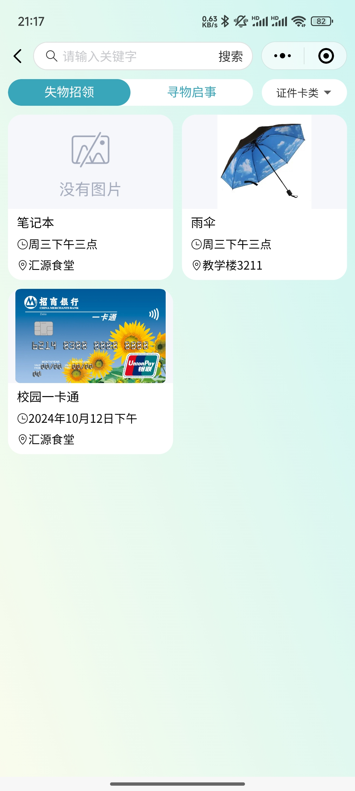

# 失物招领系统 校园失物招领小程序 （个人独立编写，不是网上资源）
## 一、介绍（获取源码，[查看文章末尾](#四-咨询我们)） 
计算机毕业设计 失物招领系统 校园失物招领小程序，前后端分离，基于node+vue项目，有登录、注册、在线聊天，发布物品等功能
 同时还有很多计算机毕设成品，都是自己亲自写的，如商城小程序，宠物领养小程序，社团小程序，宿舍管理系统等等，了解更多联系我吧

[点击我查看更多项目](https://www.yuque.com/rolling-k87y2/qrtzd0/gusuavwrtwe0ingz?singleDoc) 
## 二、技术栈
1. 前端：vue框架，微信原生小程序
2. 后端：nodejs express框架
3. 数据库：mysql

## 三、效果展示  
### 1. 用户端（小程序）

### 2. 后台管理（管理端）

## 四、🚀 咨询我们
1. **个人手敲，独立编写项目，不是网上所找的资源**
2. 提示该项目需要付费获取，编码不易，有需要或者疑问可加微信号：rolling_257
3. 扫一扫加我微信好友吧，请备注 失物招领小程序源码获取

[点击我查看更多项目](https://www.yuque.com/rolling-k87y2/qrtzd0/gusuavwrtwe0ingz?singleDoc) 

